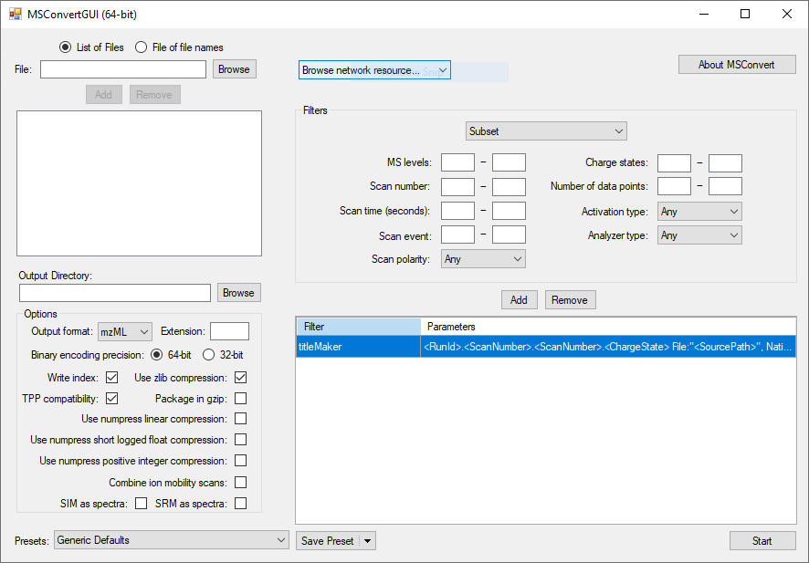
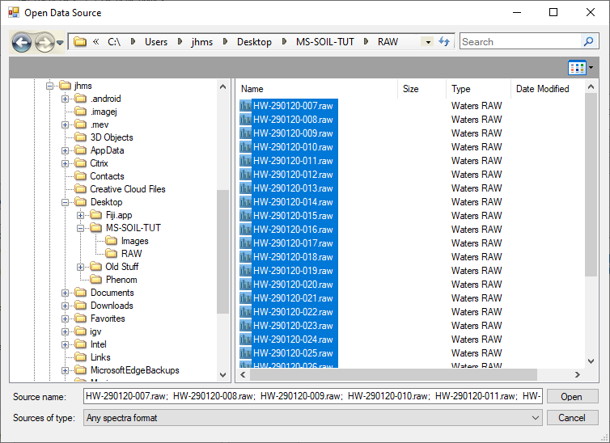

## Converting input files

Using msconvert, which is part of Proteowizard, we can convert the proprietary format mass spectrometry data into an open format. Unless there is a specific reason not to use it, mzML should be the format of choice as it is the de facto standard.

Open up msconvert, the window will look something like this:

In the right pane, a number of filters can be selected (drop down menu towards the top) to perform processing steps using vendor-specific libaries or general routines. Some of these filters will only apply to very specific mass spectrometry applications, whilst others will be more general. By default only a titleMaker filter is active. In the picture above, it is the only filter listed in the bottom of the right pane. For this tutorial, that's all we need. In other cases, we would select filters from the drop down menu, configure them, and then add them, making sure they end up in the right order. The order of filters is important if there's more than one.

Inputs and outputs are configured in the left pane. The output options in the picture above are good for what we want to do. To select our input files, click 'browse' in the top left, next to the 'file' box. In the window that pops up, navigate to the RAW directory in the project directory that you created, click the first file and, whilst holding <kbd>SHIFT</kbd>, the last file to select all the `.raw` files. Your selections should look something like this:

Choose 'Open' to tell msconvert it is these files we want to convert. The rest of the tutorial assumes that the converted files will also be in the 'RAW' subdirectory of the project directory. Normally this the default output directory. If it is not, adjust accordingly.

Finally, start the conversion by pressing the start button at the lower right corner of the main window.

## Next Steps
Next we'll [set up an R-project and pre-process the raw data for further analysis](initialR).
